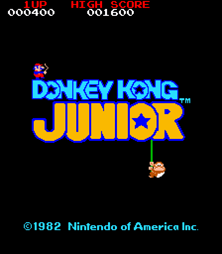

# donkey-kong-jr
Clone of the classic arcade game Donkey Kong Jr. using C++ and SDL2.

This project was part of the course TDA572/DIT455 Game engine architecture, Gothenburg university. It uses a component-based architecture where game objects has lists of components that define behaviors and create effects like graphics, audio, input, etc. It is not an implementaion of the full original game but only the first level that is repeated.

This repository does not include the SDL2 files, so if you want to download, build and test the game, you have to include and link SDL2 to the project. This includes SDL2, SDL2_mixer, SDL2_ttf and SDL2_image.
